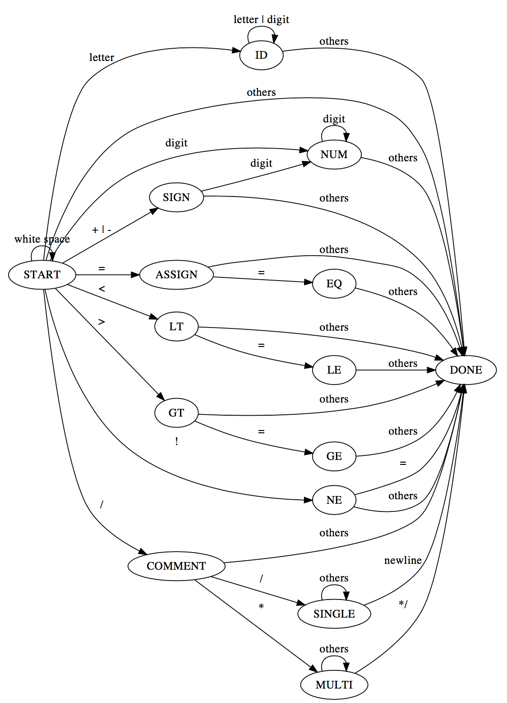

Compiler Design
===
## Introduction
實作一個簡單的Ｃ語言編譯器。
- [x] Scanner (2018/05/16)
- [x] Scanner Test (2018/05/16) 
- [ ] Parser (正在進行) (2018/05/29)
- [ ] Code Generator (正在進行) (2018/05/29)
## Scanner
> 更新時間: Tue, May 22, 2018

Scanner 目的為讀取 source file 切成一個個 token，並分類每個 token 的型態。
#### Data Type Define
我在 Scanner 定義了一種資料型態 (Data Type)，命名為 TokenType。對於不同的 token，TokenType 有以下的定義。
``` 
TokenType  Token
-----------------
IF         if
ELSE       else
SWITCH     switch
CASE       case
WHILE      while
INT        int
BOOLEAN    bool
CHAR       char
TRUE       True
FALSE      False
MAIN       main
ID         [letter (letter|digit)*]
NUM        [(+|-)|(digit)*]
ASSIGN     =
EQ         ==
NE         !=
LT         <
LE         <=
GT         >
GE         >=
PLUS       +
MINUS      -
OVER       /
TIMES      *
MODULO     %
SEMI       ;
COLON      :
LPAREN     (
RPAREN     )
LBRACE     {
RBRACE     }
COMMENT    //|/*
ENDFILE    EOF
OTHER      [],#&...
```
其中，```if else switch case while char int bool True False main```為保留字 (reserved word)。
#### Determine Finite Automata
下圖為scanner的DFA(Determine Finite Automata)。

#### How To Use
在 Scanner，我們有一個 Function ```getToken()```、一個character array ```token```，以及一個 FILE 指標 ```fptr```。
+ ```getToken()``` 會回傳目前得到的 token 的 TokenType。
+ ```token``` 為目前的 token string，此陣列的最大值由 ```MAXTOKENLEN``` 所定義。

## Parser
> 更新時間: Tue, May 29, 2018

在這簡單的編譯器，我暫不考慮 preprocessor 而且只會有一個 main function 而不會有其他 function。Parser 首先會分析是否有註解 ```TokenType = COMMENT```，再來是分析 main function ```main() {program body}```，之後就是在 program body 分析各種不同的 statement (尚未完成)。

我所實做的 Compiler 為 one parsing 技術，在 parsing 時便會直接產生組合語言。

## Code Generator
> 更新時間: Tue, May 29, 2018

Code generator 目的為產生 x86 組合語言提供後續 Assembler 組譯。我所設計的 Compiler 目的即為將 c 語言轉成組合語言，在這我們沒有實現轉成機器語言。(尚未完成)

## Execution
> 更新時間: Wen, May 16, 2018

在終端機執行以下指令。 
```
make
./main_x tb/file/test.cpp
```
