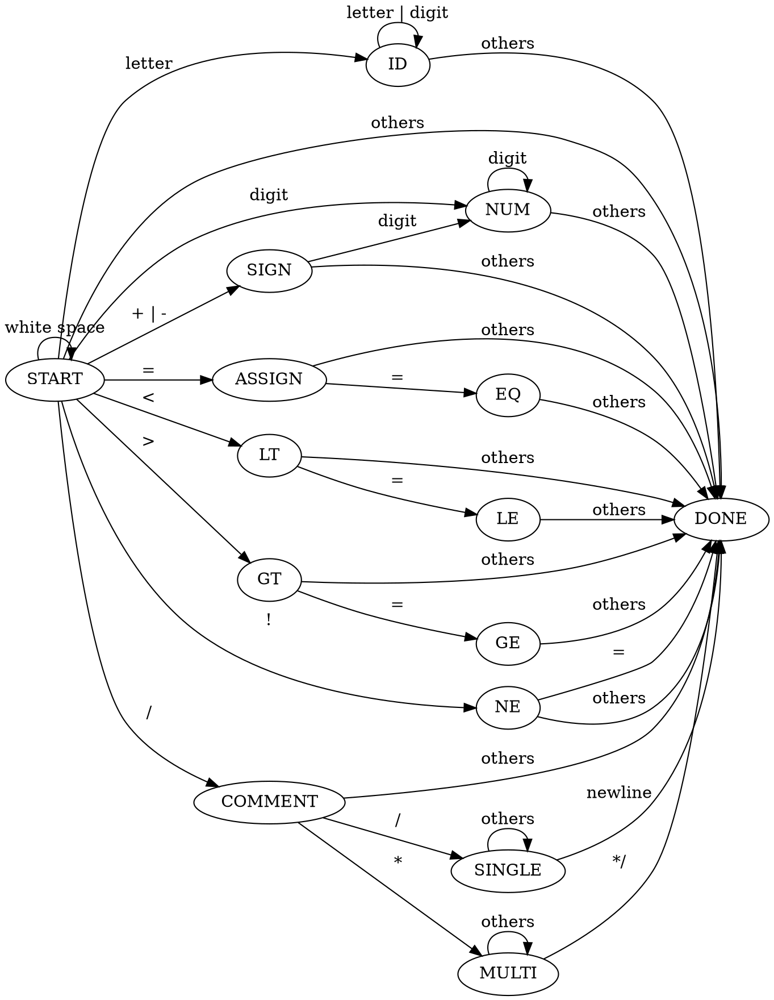

Compiler Design
===
## Introduction
實作一個簡單的Ｃ語言編譯器。
- [x] Scanner (2018/05/16)
- [x] Scanner Test (2018/05/16) 
- [ ] Parser
- [ ] Code Generator
## Scanner
> 更新時間: Wen, May 16, 2018

Scanner 目的為讀取 source file 切成一個個 token，並分類每個 token 的型態。
#### Data Type Define
我在 Scanner 定義了一種資料型態 (Data Type)，命名為 TokenType。對於不同的 token，TokenType 有以下的定義。
``` 
TokenType  Token
-----------------
IF         if
ELSE       else
SWITCH     switch
CASE       case
WHILE      while
INT        int
BOOLEAN    bool
CHAR       char
TRUE       True
FALSE      False
ID         [letter (letter|digit)*]
NUM        [(+|-)|(digit)*]
ASSIGN     =
EQ         ==
NE         !=
LT         <
LE         <=
GT         >
GE         >=
PLUS       +
MINUS      -
OVER       /
TIMES      *
MODULO     %
SEMI       ;
COLON      :
LPAREN     (
RPAREN     )
COMMENT    //|/*
ENDFILE    EOF
OTHER      []{},#&...
```
其中，```if else switch case while char int bool True False```為保留字 (reserved word)。
#### Determine Finite Automata
下圖為scanner的DFA(Determine Finite Automata)。

#### How To Use
在 Scanner，我們有一個 Function ```getToken()```、一個character array ```token```，以及一個 FILE 指標 ```fptr```。
+ ```getToken()``` 會回傳目前得到的 token 的 TokenType。
+ ```token``` 為目前的 token string，此陣列的最大值由 ```MAXTOKENLEN``` 所定義。
+ ```fptr``` 為讀取的 source file。

## Test
> 更新時間: Wen, May 16, 2018

在終端機執行以下指令，可得到 Scanner 的測試結果。
```
make scanner
./Test_scanner_x tb/file/test.cpp
```
